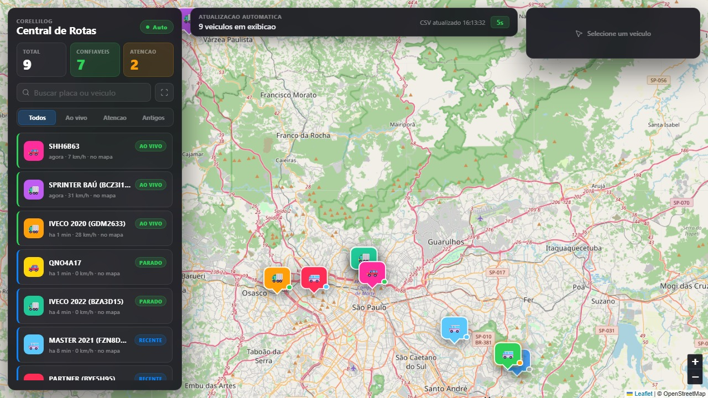

# Central de Rotas — CorelliLog

> Painel de rastreamento de frota em tempo real com mapa interativo, atualização automática e classificação de veículos por status operacional.

🌐 **Ambiente:** interno (VPS CorelliLog)

<p>
  
  
  
  
</p>

---

## Problema

A operação de logística precisava de visibilidade em tempo real sobre a localização e estado dos veículos em campo — sem contratar um sistema de rastreamento pago, que teria custo mensal elevado.

## Solução

Central de monitoramento de frota desenvolvida do zero: dados de posição via CSV atualizado automaticamente a cada 9 segundos, exibidos em mapa interativo com categorização visual por status e velocidade em tempo real.

---

## Funcionalidades

- ✅ **Mapa ao vivo** com posição de múltiplos veículos simultaneamente (9+ em exibição)
- ✅ Atualização automática a cada **9 segundos** via polling de CSV
- ✅ Ícones coloridos por status: **Ao Vivo · Parado · Recente · Antigo**
- ✅ Painel lateral com placa, modelo, velocidade e última atualização
- ✅ Filtros: Todos · Ao vivo · Atenção · Antigos
- ✅ Busca por placa ou nome do veículo
- ✅ Indicadores: **Total · Confiáveis · Atenção**
- ✅ Modo **Auto** (atualização contínua)

---

## Screenshots



---

## Arquitetura

```
[Dispositivo GPS] → [CSV atualizado] → [Backend Flask]
                                              ↓
                                    [Polling a cada 9s]
                                              ↓
                              [Frontend Leaflet.js + OpenStreetMap]
                                              ↓
                                    [Operador — browser]
```

## Stack

| Camada | Tecnologia |
|---|---|
| Frontend | HTML · CSS · JavaScript |
| Mapas | Leaflet.js + OpenStreetMap (gratuito) |
| Backend | Python · Flask · Gunicorn |
| Dados | CSV (integração com rastreador GPS) |
| Atualização | Polling automático (9s) |
| Hospedagem | VPS Linux · nginx |
| Custo total | **R$ 0,00** |

---

> Parte do ecossistema AgyLog — 5 sistemas em produção, infraestrutura 100% open-source.
